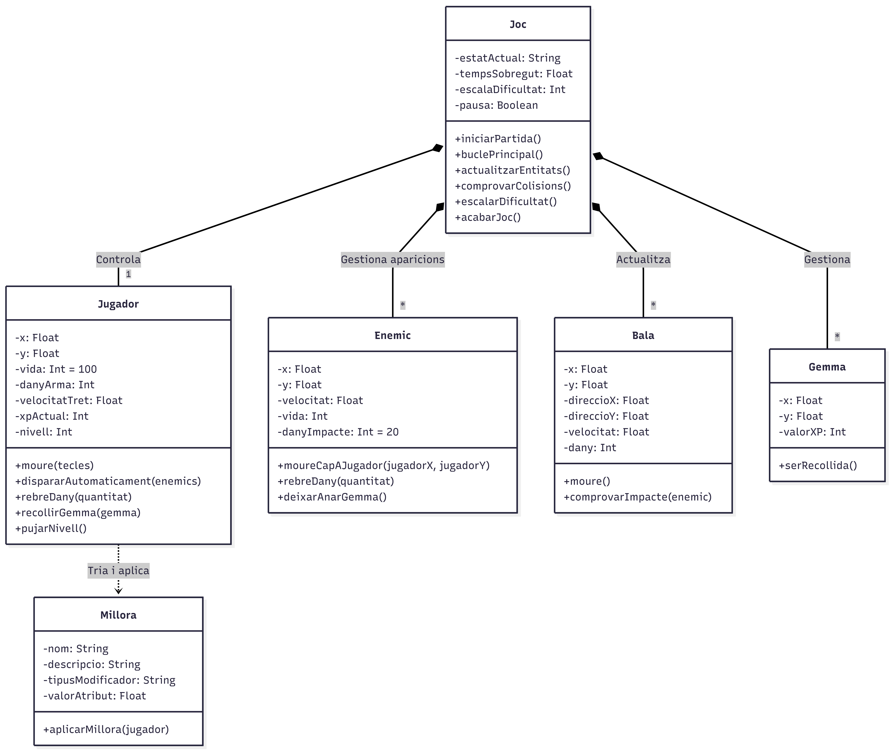
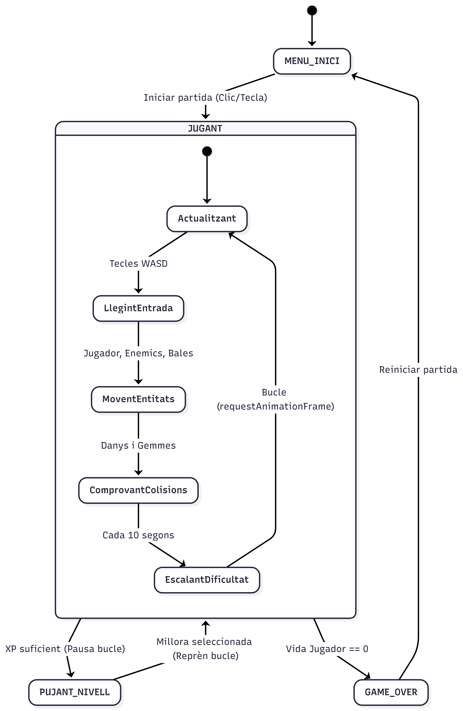

# 02_model_del_joc.md

## 1. Components principals del joc
El joc **Dead Rush** es compon de:
- **Motor de joc:** Bucle `requestAnimationFrame`.
- **Gestor d'entrada:** Moviment WASD/fletxes.
- **Gestor de col·lisions.**
- **Gestor d'aparicions:** Enemics escalats amb el temps.
- **Sistema de millores:** Selecció aleatòria i aplicació de modificadors.
- **Interfície d'usuari:** HTML/CSS per a vida, XP, temps i tria de millores.

## 2. Entitats identificades

| Entitat | Descripció |
| :--- | :--- |
| **Jugador** | Personatge controlat per l'usuari. |
| **Enemic** | Adversari que persegueix el jugador. |
| **Bala** | Projectil disparat automàticament. |
| **Gemma** | Experiència que deixen anar els enemics. |
| **Millora** | Defineix una millora seleccionable. |
| **Joc** | Controlador global. |

## 3. Atributs clau de cada entitat
*(Mantenir la mateixa descripció que en la versió anterior, amb atributs com `x, y, vida, dany`, etc.)*

## 4. Accions, mètodes o funcions principals
*(Igual que l'anterior: `moure()`, `rebreDany()`, `actualitzar()`, etc.)*

## 5. Explicació del diagrama de classes
El diagrama representa les sis classes i les relacions de composició/agregació entre **Joc** i la resta, així com l'ús de **Millora** per part de **Jugador**.



## 6. Explicació del diagrama de comportament
S'ha triat un **diagrama d'estats** per modelar la transició entre `MENU_INICI`, `JUGANT`, `PUJANT_NIVELL` i `GAME_OVER`, reflectint perfectament el bucle de joc.



## 7. Correspondència entre diagrames i codi futur
Cada classe es traduirà a una classe ES6. El diagrama d'estats es materialitzarà amb una variable `estat` dins del bucle principal.

## 8. Estructura inicial del repositori
Dead Rush/
├── index.html
├── css/
│ └── style.css
├── js/
│ ├── main.js
│ ├── classes/
│ │ ├── Jugador.js
│ │ ├── Enemic.js
│ │ ├── Bala.js
│ │ ├── Gemma.js
│ │ └── Millora.js
│ └── utils.js
├── assets/
├── docs/
│ ├── 01_idea_i_abast.md
│ ├── 02_model_del_joc.md
│ ├── ...
│ └── diagrames/
│ ├── diagrama_classes.png
│ └── diagrama_comportament.png
├── README.md
└── .gitignore


## 9. Primer commit i README inicial

**Primer commit:** `"Inicialitza projecte Dead Rush"` amb l'estructura bàsica i el README següent:

```markdown
# Dead Rush

Microvideojoc de supervivència amb hordes desenvolupat per al mòdul d'Entorns de Desenvolupament (DAM).

## Descripció
El jugador controla un personatge que dispara automàticament a l'enemic més proper. Sobrevius el màxim temps possible mentre reculls experiència i tries millores aleatòries. La dificultat escala fins fer impossible la supervivència.

## Tecnologies
- HTML5, CSS3, JavaScript (ES6+)
- Canvas API

## Com executar-lo
1. Clonar el repositori.
2. Obrir `index.html` amb un navegador (Live Server recomanat).

## Autor
Enric Rivelles